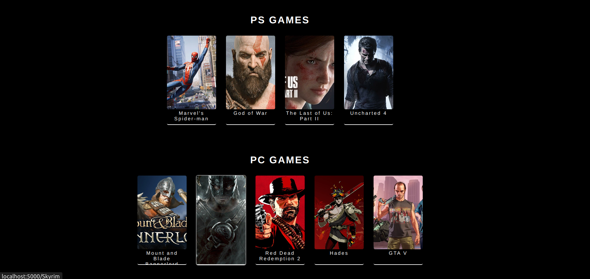
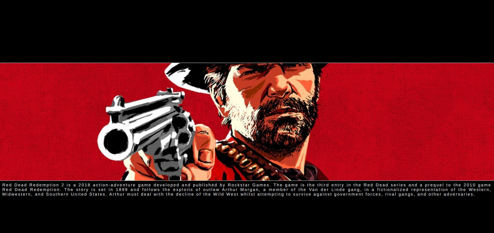

# GALLERY PROJECT

## FRONTEND PRACTICE PROJECT NO: 16

1. I used Javascript, Jquery, HTML, CSS to practice my skills.

2. There are several games seperated as PS and PC games.

3. There is a small animation on mouse enter to zoom in.

4. When we click on the game it opens a new dynamic url for that game and brings the information of that game.
